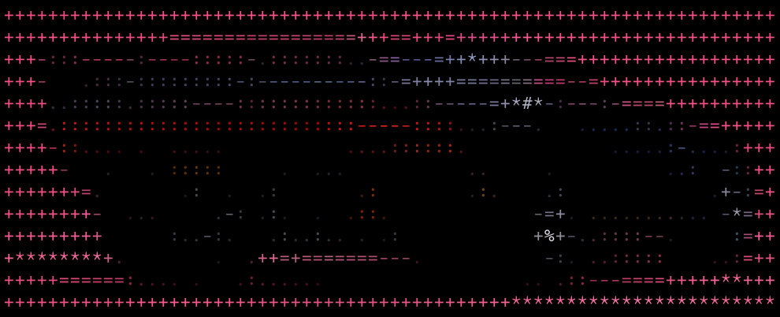

<p align="center">
  
</p>

<h1 align="center">QUADRA</h1>

<p align="center">
  <strong>accelerate remote GPU development</strong>
</p>

<p align="center">
  Quadra is a Python CLI for shipping local experiment code to RunPod Serverless,
  running workflows against a persistent network volume, streaming logs, and
  pulling artifacts back into your project.
</p>

## Quick Start

```bash
quadra init bonsai
cd bonsai
quadra sync
quadra submit smoke
quadra logs
quadra pull
```

For the built-in workflow shortcuts:

```bash
quadra smoke
quadra bench
```

If you are already inside the target directory, `quadra init` also works without a
project name:

```bash
mkdir bonsai
cd bonsai
quadra init
```

## Core Commands

- `quadra init [project_name]` scaffolds a Quadra project in a new or current directory.
- `quadra sync` pushes the local project into the configured RunPod network volume.
- `quadra submit <workflow>` submits a workflow job to the configured Serverless endpoint.
- `quadra logs` streams logs for the most recently submitted run.
- `quadra pull [run_id] [destination]` downloads a completed run into `runs/<run_id>/`.
- `quadra smoke` and `quadra bench` run the full sync-submit-logs-pull loop for the named workflow.
  They print sync, submit, polling, and pull progress as they run.

## RunPod Serverless Model

Quadra targets RunPod Serverless only.

- Project sync and artifact pull use the RunPod S3-compatible API against the configured network volume.
- `quadra init` writes valid serverless `gpu_ids` pool values into `quadra.toml` as inline comments.
- `quadra init` also writes a `quadra_worker.py` worker script plus a configurable `[runtime.runpod.template]` block.
- The remote project directory defaults to `/runpod-volume/projects/<project_name>`.
- The first `submit` creates the configured RunPod template and endpoint if they do not already exist.
- `submit` sends a workflow job to a persistent Serverless endpoint.
- `logs` uses the saved local run reference to follow the latest submission.
- `pull` downloads the remote run directory back into the local project.

Your network volume must live in a RunPod datacenter that supports the S3-compatible API. Quadra checks this up front and fails early when the selected volume cannot be used for sync and artifact pull.

## Worker Contract

By default, Quadra creates a serverless template that starts:

```bash
python -u /runpod-volume/projects/<project_name>/quadra_worker.py
```

That worker script is scaffolded into the project root by `quadra init`, synced into the network volume by `quadra sync`, and can be replaced by editing `[runtime.runpod.template]` in `quadra.toml`.

The default worker expects a network volume mounted at `/runpod-volume`, runs the configured setup command, executes the workflow inside `src/experiment`, and writes logs, status, and artifacts under:

```text
/runpod-volume/projects/<project_name>/runs/<run_id>/
```

`timeout_seconds` in `runtime.runpod` is applied to the endpoint execution timeout when Quadra creates the endpoint.

## Build And Install

Build the standalone CLI executable with:

```bash
just build-cli
```

This writes the binary to `dist/quadra`.

Install it into `~/.local/bin` with:

```bash
just install-cli
```

That command symlinks `dist/quadra` to `~/.local/bin/quadra`.

## Project Layout

`quadra init <project>` creates:

```text
<project>/
  quadra.toml
  quadra_worker.py
  src/
    libs/
      diffusers/
      transformers/
      vllm-omni/
    experiment/
      pyproject.toml
      main.py
      scripts/
        smoke.py
        bench.py
  models/
  caches/
  runs/
  .quadra/
```
